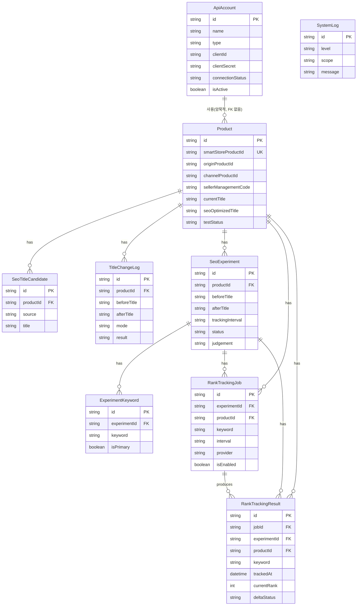

# DB 스키마 설계 (검증본)

작성: Claude · 기준 파일: `prisma/schema.prisma` (Codex 1차 구현본을 검증하고 보완 지시를 덧붙인 문서)

현재 `prisma/schema.prisma`는 요구사항의 9개 테이블(`api_accounts`, `products`, `seo_title_candidates`, `title_change_logs`, `rank_tracking_jobs`, `rank_tracking_results`, `seo_experiments`, `experiment_keywords`, `system_logs`)을 모두 Prisma 모델로 구현했고, 전 테이블에 `createdAt`/`updatedAt`이 있다. 요구사항 골격은 충족한다. 아래는 확정 스키마와, 실제 구현에서 고쳐야 할 부분이다.

## 1. ERD



`ApiAccount`와 `Product`는 명시적 FK로 묶지 않는다. 계정은 "어떤 스토어/채널에 접근할 권한"을 나타내고 상품은 그 채널에 속한 데이터라서, 상품이 계정 삭제에 딸려 지워지면 안 되기 때문이다. 필요하면 `Product.channelId`로 느슨하게 매칭한다.

## 2. 상품 식별자 분리 원칙 (중요)

요구사항 5번의 핵심 지시사항이다. 4개 필드를 반드시 구분해서 저장한다.

| 필드 | 의미 | 용도 |
|---|---|---|
| `Product.id` | 내부 PK (cuid) | 이 프로그램 내부에서만 쓰는 식별자, 다른 시스템에 노출 안 함 |
| `smartStoreProductId` | 스마트스토어 노출 상품 번호 | 검색 결과에서 상품을 매칭할 때 사용 (unique) |
| `originProductId` | 원상품 ID | 옵션/기획전 등으로 파생된 상품의 원본을 추적 |
| `channelProductId` | 채널상품 ID | 커머스API 기준 채널별 상품 식별자 (스마트스토어 API 응답의 `channelProducts[].channelProductNo`에 대응) |
| `sellerManagementCode` | 판매자관리코드 | 셀러가 자체적으로 관리하는 SKU 코드, MVP/OMS와의 매칭 키로 가장 유력 |

MVP/OMS와 통합할 때 매칭 우선순위는 `sellerManagementCode` → `channelProductId` → `smartStoreProductId` 순으로 시도하도록 어댑터를 설계한다 (`MVP_OMS_INTEGRATION_PLAN.md` 참고). 내부 `id`는 절대 외부 매칭 키로 쓰지 않는다.

## 3. 현재 구현에서 고쳐야 할 것 (Codex 반영 필요)

1. **시크릿 평문 저장 — 최우선 수정.** `ApiAccount.clientSecret`, `accessLicense`, `secretKey`가 DB에 평문으로 들어간다(`prisma/seed.ts`, `routes/index.ts` 확인됨). `ENV.example`에 `ENCRYPTION_SECRET`이 정의돼 있고 `docs/API_ACCOUNT_SETUP.md`에도 "저장 전 암호화"라고 적혀 있지만 실제 코드에는 암호화 레이어가 없다. `lib/crypto.ts`를 만들어 Node `crypto` 모듈의 AES-256-GCM으로 저장 직전 암호화, 조회 직후 복호화하도록 감싼다. 마스킹(`lib/mask.ts`)은 이미 있으니 그대로 두되, 마스킹은 "화면 노출"용이고 암호화는 "저장"용이라는 것을 구분해야 한다.
2. **인덱스 부재.** 다음 필드에 `@@index`를 추가한다: `RankTrackingResult(jobId, trackedAt)` (시계열 조회), `RankTrackingResult(productId, keyword, trackedAt)` (상품·키워드별 조회), `RankTrackingJob(experimentId)`, `TitleChangeLog(productId, createdAt)`, `SeoExperiment(productId, status)`. 지금은 시드 데이터라 안 보이지만 30분 간격으로 계속 쌓이는 `RankTrackingResult`는 인덱스 없이 운영하면 금방 느려진다.
3. **`trackingKeywords`를 콤마 구분 문자열로 저장.** `Product.trackingKeywords`가 `"대용량 텀블러,보온 텀블러"` 형태의 String이다. SQLite에서 배열 컬럼이 없어 임시방편으로는 허용하지만, 키워드에 콤마가 들어가면 깨지고 키워드별 검색(분석 화면 요구사항)이 불가능하다. `ProductTrackingKeyword` 같은 별도 조인 테이블을 추가하거나, 최소한 JSON 문자열 + 애플리케이션 레벨 파싱으로 콤마 이슈를 막는다. PostgreSQL 이전을 고려하면 별도 테이블이 정답이다.
4. **`RankTrackingResult.jobId` 들여쓰기 오타.** 기능에는 영향 없지만 스키마 정렬이 깨져 있다 (`jobId           String`처럼 다른 필드와 정렬이 안 맞음). 리팩토링 시 정리.
5. **Cascade 삭제 범위 재검토.** 지금 모든 관계가 `onDelete: Cascade`다. `Product` 삭제 시 `TitleChangeLog`(변경 이력)까지 같이 삭제되는데, 요구사항 14번 "상품명 변경 전후 이력은 반드시 저장할 것"과 상충한다. 상품을 완전히 지우는 대신 `productStatus`를 `DISCONTINUED` 같은 값으로 바꾸는 소프트 삭제를 쓰고, 실제 하드 삭제는 관리자 전용 백업/복원 기능에서만 허용하도록 서비스 레이어에서 강제한다.
6. **`SystemLog`에 아무도 쓰지 않음.** 모델은 있는데 실제로 insert하는 코드가 없다. 상품명 변경 실패, 랭킹 추적 실패, 연결 테스트 실패 시 반드시 `SystemLog`에 남기도록 서비스 레이어에 공통 로거를 추가한다 (요구사항 F "실패 시 원인 로그", 11번 "실패 로그 상세 기록").

## 4. 향후 보강 필드 (요구사항 11번 대응)

`SeoExperiment`에 다음 메모 필드들을 추가해야 한다 (현재 스키마에는 `notes` 하나만 있어 구조화가 안 됨). 아래처럼 명확한 필드로 분리한다.

```prisma
model SeoExperiment {
  // ...기존 필드 유지...
  adRunning          Boolean  @default(false)   // 광고 집행 여부
  priceChanged       Boolean  @default(false)   // 가격 변경 여부
  reviewCountNote    String?                     // 리뷰 수 변화 메모
  salesVolumeNote    String?                     // 판매량 변화 메모
  algorithmChangeNote String?                    // 네이버 알고리즘 변경 메모
  externalFactorNote String?                     // 외부 요인 기록
  excludedFrom       DateTime?                    // 테스트 제외 기간 시작
  excludedUntil      DateTime?                    // 테스트 제외 기간 종료
}
```

이 필드들은 분석 화면(G)에서 "이 실험 결과가 순수 SEO 효과인지, 외부 요인이 섞였는지" 필터링하는 데 쓰인다.

## 5. PostgreSQL 이전 대비 원칙

- `String @id @default(cuid())` 유지 (SQLite/PostgreSQL 모두 호환, auto-increment 정수 PK 쓰지 않음)
- 모든 enum은 Prisma `enum`이 아니라 `String`으로 저장하고 애플리케이션/공유 타입(`packages/shared`)에서 유니온 타입으로 검증 — 이미 이렇게 되어 있음, SQLite가 네이티브 enum을 지원하지 않기 때문에 올바른 선택. PostgreSQL로 옮길 때도 그대로 유지 가능
- JSON이 필요한 곳(예: `SystemLog.metaJson`)은 `String`에 직렬화해서 저장 — PostgreSQL의 `Json` 타입으로 나중에 바꿀 수 있게 서비스 레이어에서 `JSON.parse`/`stringify`를 감싸는 헬퍼 하나로 통일해둘 것
